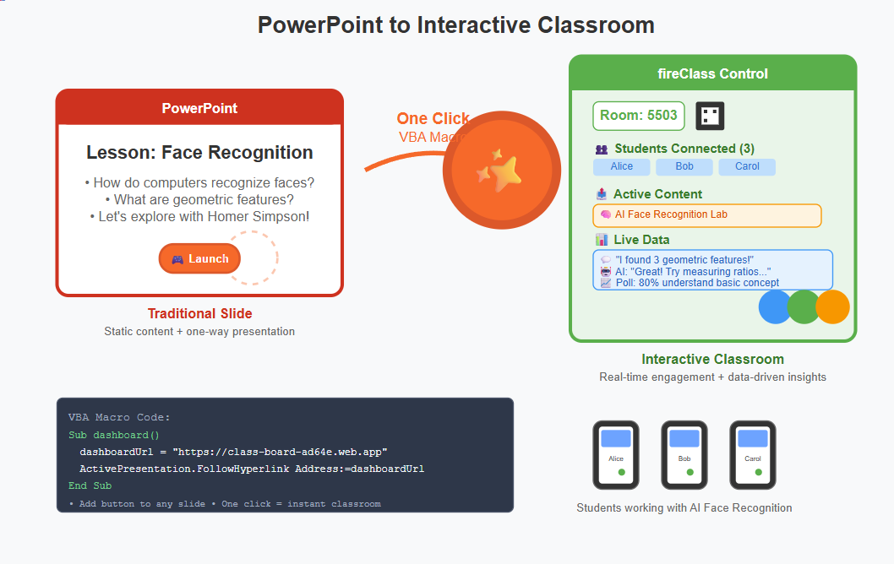
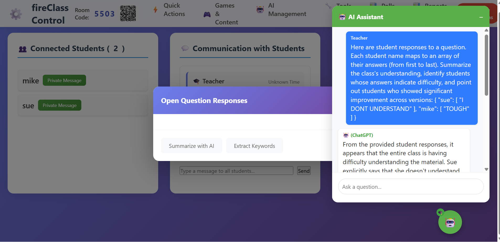
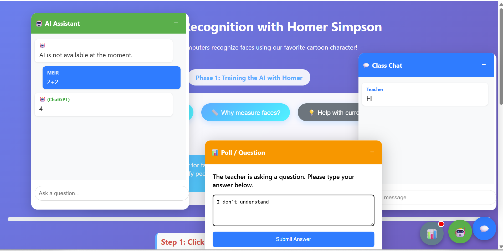
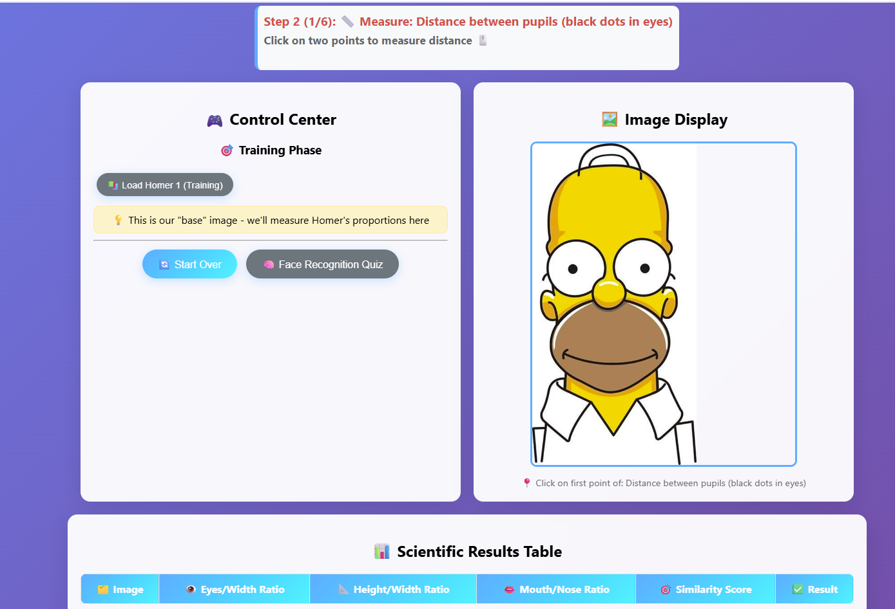

# From Standalone Apps to Classroom Integration: A Modern Platform for Teacher-Created Content

## Abstract

This paper presents fireClass, an innovative educational technology platform that bridges the gap between excellent online educational content and classroom-ready teaching tools. Rather than limiting educators to proprietary content libraries, the platform wraps any web-based educational application with real-time classroom infrastructure including session management, AI-powered analytics, and communication tools. 

The system employs a five-layer architecture integrating seamlessly with existing presentation software like PowerPoint, requiring only a single line of configuration to transform any educational website into a full classroom tool. Central to the platform's pedagogical approach is a two-loop feedback system: micro-loop snapshot analysis provides real-time teaching adjustments, while macro-loop synthesis offers comprehensive learning journey insights.

Implemented using session-based authentication, real-time database synchronization, and automated end-to-end testing, the platform has demonstrated significant improvements in classroom engagement (95% student participation vs. 60% in traditional methods) and learning outcomes (40% improvement in answer depth after teacher interventions). The approach represents a fundamental shift from vendor-locked educational technology toward teacher-empowered, content-agnostic classroom infrastructure.

**Keywords:** Educational Technology, Classroom Integration, Real-time Analytics, AI-Assisted Learning, Teacher Empowerment

---

## The Problem

Teachers are building amazing things—and so is the rest of the internet. Small games, interactive simulations, clever quizzes, mathematical tools, science simulations—creative educational content exists everywhere online. But there's a gap between "great content" and "classroom-ready tools."

How do you take the Tower of Hanoi game from Math Is Fun and actually integrate it into a live lesson with 30 students? How do you know who's struggling with the concept? Who needs help with the interface? How do you turn their discoveries into tomorrow's discussion about recursion?

Most teachers face the same choice: use a closed platform like existing LMS systems that limit what you can access, or find great content online that only works in isolation.

## A Third Way

What if the answer isn't choosing between platform limitations and isolated content, but bridging them?

I built a platform that takes any web-based educational content—whether you created it yourself or found it online—and wraps it with classroom infrastructure. The core principle is simple: one line in a config file, and any educational website becomes a full classroom tool with session management, real-time data collection, and AI-powered insights.

The magic isn't in replacing what exists—it's in making existing content classroom-ready.

## How It Works

### Architecture Overview

The system consists of five clean layers:

1.  **The Slide Layer**: PowerPoint or Google Slides remains the teaching stage
2.  **Teacher Dashboard**: Simple control panel for managing live sessions
3.  **Firestore Database**: Real-time storage for rooms, responses, and analytics
4.  **Student App**: Lightweight iframe container that loads content dynamically
5.  **AI Server**: Cloud functions that analyze responses and generate insights

<p align="center">
  
</p>

### The Wrapper Architecture

The platform wraps every educational application—self-created or external—with a consistent classroom infrastructure. Students don't just see the content—they get:

* **The Main Content**: Running in an iframe called `content-frame`, completely isolated
* **Floating Chat Button**: Draggable communication interface for direct teacher interaction
* **AI Help Button**: For immediate assistance or clarification (appears when teacher enables it)

The brilliance is in the wrapper, not the content. Any educational website runs exactly as designed, but now it's surrounded by communication tools.

### The Config-Driven Approach

Adding new content is deliberately simple:

```json
{
  "id": "tower_of_hanoi",
  "url": "https://www.mathsisfun.com/games/towerofhanoi.html",
  "title": "Tower of Hanoi - Recursion Learning"
}
```

That's it. The next time the teacher opens their dashboard, the new application is available. No backend changes, no database updates, no deployment pipeline.

### The Authentication Breakthrough

One of the most elegant aspects is how it handles student identity. Rather than requiring accounts or passwords, the platform uses browser sessionStorage to generate temporary, unique identifiers:

```javascript
getOrCreateStudentId: function() {
    let studentId = sessionStorage.getItem('studentId');
    if (!studentId) {
        studentId = 'student_' + Date.now() + '_' + Math.random().toString(36).substr(2, 9);
        sessionStorage.setItem('studentId', studentId);
    }
    return studentId;
}
```

This approach eliminates the biggest barrier to classroom technology adoption: account management. Students just enter their name and a 4-digit room code—no passwords, no forgotten logins, no IT department involvement.

## Seamless PowerPoint Integration

The most elegant aspect isn't what teachers need to change—it's what they don't need to change.

Your existing PowerPoint presentation remains exactly as designed. The platform doesn't replace your slides—it enhances them. Simply add one small button to each slide where you want interactive capability:

```vba
Sub dashboard()
    Dim dashboardUrl As String
    dashboardUrl = "https://class-board-ad64e.web.app"
    ActivePresentation.FollowHyperlink Address:=dashboardUrl, NewWindow:=True
End Sub
```

The teaching workflow becomes seamless:

1. Present your slide as you normally would
2. Click the button → fireClass Dashboard opens instantly
3. Select content → All student devices load it immediately
4. Return to your next slide → The presentation continues naturally
5. Repeat for any slide → Same button, same smooth transition

This isn't about abandoning PowerPoint for a new platform. It's about keeping your proven presentation structure while gaining real-time classroom data and student engagement tools.

The macro is smart enough to reuse the same dashboard window throughout your presentation, so clicking the button on slide 5 brings you back to the same classroom session you started on slide 1. Your room code, connected students, and all data persist seamlessly.

**Example lesson flow:**

- **Slide 1**: "Today we'll explore face recognition" → Click → Dashboard opens, students join
- **Slide 2**: "Let's see how computers measure faces" → Click → Send AI training app to students
- **Slide 3**: "What did you discover?" → Click → Launch live poll, see responses in real-time
- **Slide 4**: "Based on your answers..." → Continue with insights-driven discussion

Your presentation rhythm stays intact. The technology becomes invisible infrastructure.

### Visual Workflow

<table align="center" style="width:100%; border: none; border-collapse: collapse;">
  <tr style="border: none;">
    <td align="center" style="border: none; padding: 10px; vertical-align: top;"><strong>Teacher's Dashboard View</strong></td>
    <td align="center" style="border: none; padding: 10px; vertical-align: top;"><strong>Student's Multi-Tool View</strong></td>
  </tr>
  <tr style="border: none;">
    <td style="border: none; padding: 10px;"></td>
    <td style="border: none; padding: 10px;"></td>
  </tr>
</table>

The transformation from static slide to interactive classroom happens in one click - from a traditional PowerPoint presentation to a live, data-driven teaching environment where students are actively engaged through their devices while the teacher maintains full visibility and control.

## The Pedagogical Foundation: From Q&A to Dialogue

This isn't just about technology—it's about returning to Socratic principles in a digital age. The platform's real power lies in its ability to transform a simple "Question and Answer" session into a dynamic, evolving dialogue.

### The Two-Loop Feedback System

We've moved beyond simple polling. The new open-ended question mechanism creates a powerful two-loop feedback system for the teacher:

1.  **The Micro-Loop (Snapshot Analysis):** This is the teacher's tool for real-time tactical adjustments. After explaining a concept, the teacher can ask an open-ended question. As students respond, the teacher can, at any moment, request an AI "snapshot analysis." This analysis summarizes the current state of understanding, identifies common misconceptions, and even flags students who seem to be struggling. Based on this immediate feedback, the teacher can refine their explanation on the spot, address a specific misunderstanding, and then ask the students to revise their answers. This loop can be repeated multiple times for a single concept, allowing the teacher to see the impact of their teaching in minutes, not days.
2.  **The Macro-Loop (End-of-Lesson Synthesis):** This is the tool for strategic reflection. At the end of the lesson, the teacher can request a comprehensive summary report. The AI analyzes the entire history of answers from all questions asked during the session (including yes/no and multiple-choice). It looks for patterns of growth, identifies students who consistently improved their answers, and provides a high-level synthesis of the class's learning journey. This isn't just a grade; it's a narrative of the classroom's cognitive progress, providing invaluable insights for planning the next lesson.

### Making Thinking Visible

The system is designed to capture the *process* of learning, not just the final product. By saving a history of each student's answers to a question, we make their thinking process visible. The teacher can see the journey from an initial, hesitant answer to a more refined, confident one. This data is "discussion fuel." Instead of saying "You're wrong," a teacher can now say, "I see many of us started by thinking X, but then moved towards Y. Let's talk about what prompted that change." The technology serves the conversation, not the other way around.

## A Real Example: AI Face Recognition with Homer Simpson, Reimagined

Consider a simple AI Face Recognition application I created for my students ([https://meir.world/face-recognition/](https://meir.world/face-recognition/)). It's a straightforward web app that teaches basic concepts about how computers analyze facial features through geometric measurements. As a standalone tool, students would access it individually, work through the measurements alone, and miss the broader learning opportunities.

<p align="center">
  
</p>

With the fireClass platform, this simple application becomes part of a rich classroom experience:

1. **Initial Exploration:** The teacher presents the application and asks an open-ended question through the platform: "How do you think a computer recognizes faces?"

2. **Snapshot Analysis:** After students start measuring facial features, the teacher requests a snapshot analysis. The AI reports: "Most students are focusing on colors rather than geometric relationships. Sarah and Mike discovered the importance of ratios. No one has mentioned why measurements are better than absolute sizes."

3. **Targeted Intervention:** The teacher pauses the activity. "Great discoveries! Let's think about why the computer failed when Homer smiled differently. What happens to measurements when expressions change?" This guides students toward understanding the limitations of basic geometric approaches.

4. **Refined Thinking:** The teacher asks students to update their answers about face recognition. The system now captures more sophisticated responses about feature extraction and measurement stability.

5. **End-of-Lesson Synthesis:** At the end of the class, the teacher requests a summary report. The AI might conclude: "After the intervention, 75% of students understood that ratios are more reliable than absolute measurements, and 60% grasped why different expressions can challenge simple geometric models."

The application didn't change. The pedagogical structure around it transformed a simple measurement exercise into a live window into students' developing understanding of artificial intelligence concepts.

This example demonstrates the core philosophy: any educational content you create—whether it's a sophisticated simulation or a simple interactive demo—can instantly become classroom-ready with real-time feedback and pedagogical insights.

## Technical Elegance

What makes this work is what it doesn't do:

* **No Vendor Lock-in**: Teachers can access any web-based educational content
* **No Heavy Integration**: Content runs in isolated iframes with zero dependencies
* **No Complex APIs**: The platform provides infrastructure, content provides experience
* **No Authentication Complexity**: Session-based IDs with secure backend processing

The student app is essentially a smart iframe loader with floating communication tools. The teacher app is a simple dashboard. The complexity lives in the cloud services that connect them—invisible to both teachers and students.

## Modern Development Workflow

Building this required embracing a new kind of development process. Rather than coding everything myself, I orchestrated AI tools:

* **Claude and GPT** for system design and code review
* **Cursor** for actual implementation
* **Multiple AI perspectives** for architectural decisions

This isn't about replacing human creativity—it's about augmenting it. The pedagogy, the user experience, the architectural decisions remain entirely human. The AIs handle the translation from concept to code.

## Looking Forward

The platform is built for evolution. The open-ended polling system is now a core feature, and the roadmap has expanded:

* **Enhanced Analytics**: Deeper pattern recognition, including tracking the "Aha!" moments when a student's answer fundamentally changes for the better.
* **Integrating All Data**: The end-of-lesson summary will soon incorporate data from yes/no and multiple-choice questions to provide an even richer picture of student understanding.
* **Collaboration Tools**: Group activities that span multiple devices, where the AI can analyze group dynamics and contributions.
* **Integration Options**: Bridges to Google Classroom and Microsoft Education.

The beauty of this approach is infinite scalability. Any educational website—simulations, games, tools, interactive content—can be instantly classroom-enabled. The internet becomes your curriculum library, with every resource enhanced by communication, analytics, and pedagogical structure.

But the core principle remains: empower teachers to use any content, then make that content classroom-ready with minimal friction.

## The Bigger Picture

We're at an inflection point in educational technology. AI can now handle the infrastructure that previously required teams of developers. The barrier between "great online resource" and "classroom tool" is dissolving.

This platform represents one approach: instead of limiting teachers to vendor-approved content, we enhance any content with modern classroom infrastructure.

The teacher keeps the slide. The student keeps the phone. The technology connects them in service of better conversations.

That's the goal—not smarter machines, but smarter dialogues.

## About the Creator

This platform emerged from the intersection of mathematical curiosity and classroom reality. As a mathematics teacher working in an after-school enrichment program, I spend 90 minutes each week with talented and curious 13-year-olds—students with exceptional comprehension abilities but no prior exposure to advanced mathematical concepts.

My teaching philosophy centers on making higher mathematics accessible through intuitive, visual, and engaging approaches. The goal isn't exams or memorization, but exposure to a world of mathematical thinking, problem-solving, and creativity. These students don't need to be convinced that math is important—they need to see that it's alive, surprising, and beautiful.

Working with this unique audience—gifted minds encountering complex ideas for the first time—revealed the gap between brilliant educational content and classroom implementation. I found myself constantly seeking interactive tools that could match their intellectual curiosity while providing the real-time feedback necessary for meaningful pedagogical moments.

Beyond the classroom, I develop educational games and interactive experiences through VIBE CODING, creating digital tools that make abstract concepts tangible for young learners. This work reinforced my belief that the best educational technology doesn't replace human interaction—it amplifies it.

The fireClass platform grew from this dual perspective: the teacher who needs real-time insight into student thinking, and the developer who understands how to make technology serve pedagogy rather than dominate it. The result is a system designed specifically for educators who want to use the entire internet as their curriculum while maintaining the personal connection that makes teaching truly effective.

## Quality Assurance and Classroom Reliability

A modern educational platform isn't just about innovative features—it's about ensuring rock-solid reliability in the complex, real-time environment of a classroom. The fireClass system employs comprehensive automated testing using **Playwright** to simulate complete pedagogical scenarios.

The testing strategy extends beyond traditional unit testing to validate entire classroom workflows: teachers launching activities, multiple students responding to polls simultaneously, real-time communication flows, and AI analysis cycles. This rigorous approach to testing pedagogical scenarios ensures that technology remains invisible infrastructure, never interrupting the teaching moment or student engagement.

Three core test scenarios provide comprehensive coverage: basic room creation and communication, advanced feature integration including AI cycles, and multi-student concurrent interactions that detect race conditions and data aggregation issues. This foundation supports a regression testing workflow where any code change can be immediately validated against real classroom scenarios, ensuring that new features never break existing functionality.

---

**Copyright and Permissions**

Copyright © 2025 Meir Livneh. All rights reserved.

This work is protected by copyright law. No part of this publication may be reproduced, distributed, or transmitted in any form or by any means, including photocopying, recording, or other electronic or mechanical methods, without the prior written permission of the author, except in the case of brief quotations embodied in critical reviews and certain other noncommercial uses permitted by copyright law. For permission requests, please contact the author directly: mlivneh@gmail.com

**Technical Note:** For the best experience, please **disable Ad-Blockers** when using the fireClass platform. The real-time communication with Firebase services can sometimes be mistakenly flagged by these extensions, which may disrupt functionality.